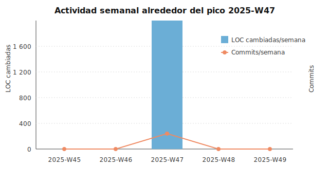

# Picos de actividad: noviembre 2025 (semana 47)

## Resumen ejecutivo
La historia del repositorio está concentrada en una sola ventana de alta actividad (semana 47 de 2025), en la que se realizaron 16 commits y 1 542 LOC modificadas (adiciones + eliminaciones). La semana se caracteriza por la creación de los pipelines de ingesta y clasificación de temas, más herramientas de análisis de repositorios.

## Metodología
- Fuente: `git log --numstat` sobre toda la rama principal del repositorio.
- Agregación: número de commits y LOC cambiadas por semana (ISO-8601).
- Selección de picos: se ordenaron las semanas por LOC cambiadas y se tomó el top 3. Solo existe una semana con actividad, por lo que se documenta ese pico.
- Visualización: barras para LOC y línea para commits dentro de una ventana de ±3 semanas alrededor del pico.

## Pico 1 – Semana 2025-W47 (17–23 nov 2025)

**Contexto y métrica**
- 16 commits y 1 542 LOC cambiadas.
- Trabajo concentrado en la puesta en marcha del pipeline de datos (recolección → limpieza → clasificación) y documentación narrativa inicial.

**Commits clave**
- 135b929 — *Add topic classification pipeline* (scripts/generate_topics.py, +410 LOC). Construye el pipeline de clasificación de tópicos a partir de textos procesados.
- 5c85310 — *Add GitHub repo harvester script* (tools/repo_harvester.py, +288 LOC). Añade el recolector para descargar metadatos de repositorios desde la API de GitHub.
- f0c3301 — *Add analysis notebook for activity metrics* (notebooks/analysis.ipynb, +241 LOC). Notebook para explorar métricas de actividad y gráficos.
- c5c9a12 — *Add commit cleaning script for processed data* (scripts/clean_data.py, +191 LOC). Limpieza y normalización de commits para el set procesado.
- 65ef9d7 — *Initial commit* (+203 LOC). Estructura inicial del proyecto y configuración base.

**Impacto**
- **Nueva feature**: pipelines de recolección y clasificación de tópicos (scripts `repo_harvester.py`, `generate_topics.py`).
- **Performance/productividad**: automatización de limpieza de commits (`scripts/clean_data.py`) reduce trabajo manual previo al análisis.
- **Aprendizaje/insight**: notebook de métricas (`notebooks/analysis.ipynb`) facilitó validar el enfoque de medición de actividad.
